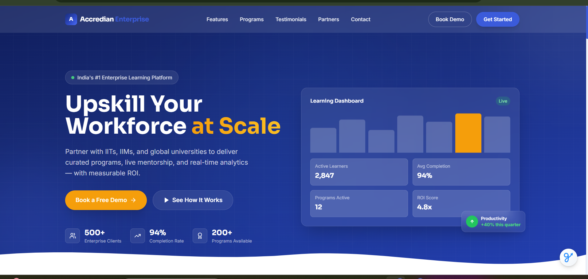
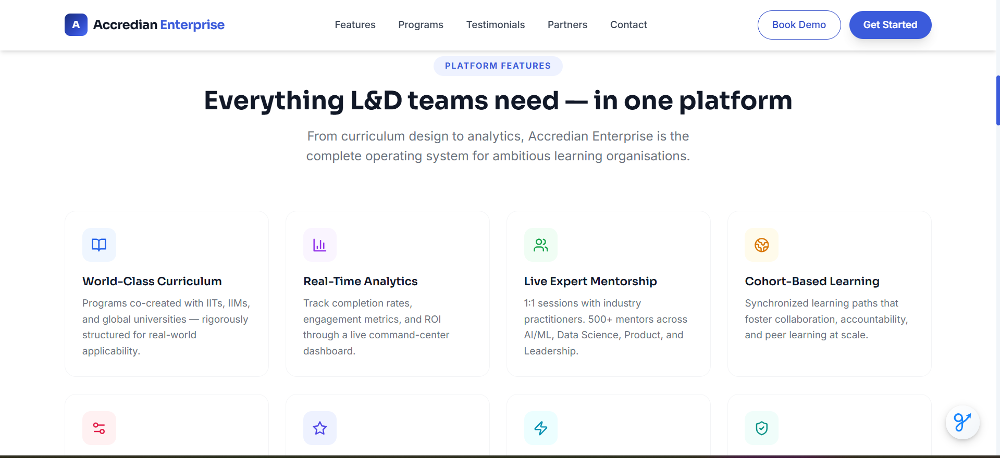
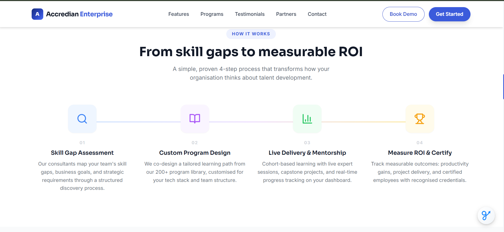
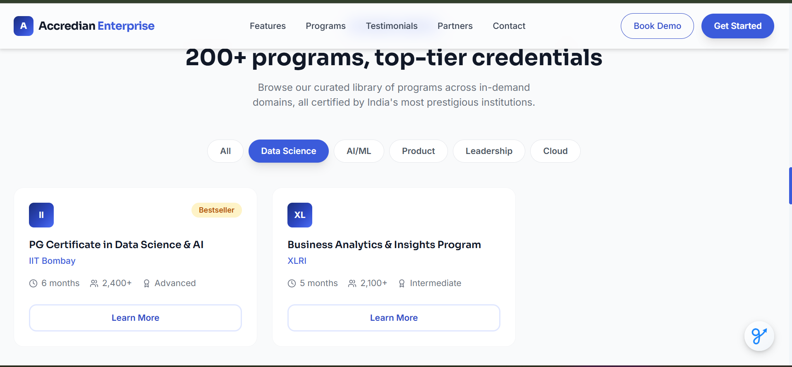
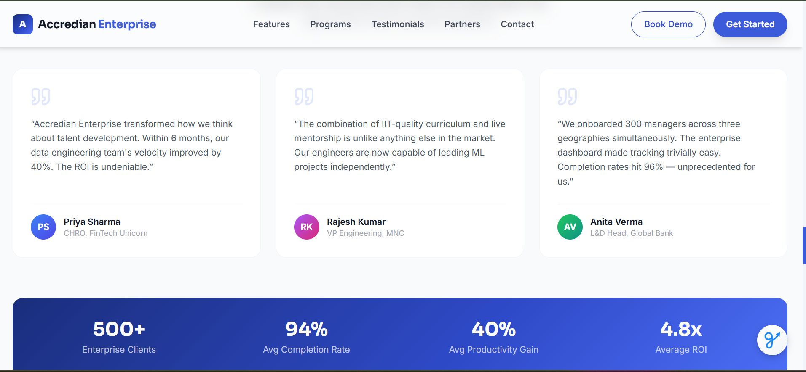
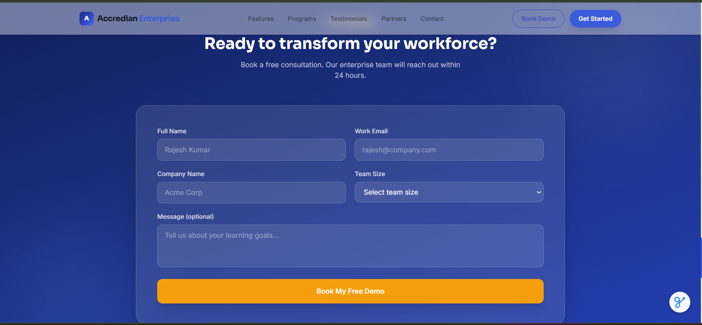

# Accredian Enterprise — Partial Clone

A fully responsive Next.js 14 recreation of the Accredian Enterprise landing page, built for the Full Stack Developer Intern assignment.

## Live Demo

https://accredian-enterprise-mv00hk6ua-vamsidhar3081s-projects.vercel.app

## Tech Stack 🛠

| Technology | Usage |
|---|---|
| Next.js 14 (App Router) |
| Tailwind CSS | Styling | 
| Lucide React | Icons |
| Next.js API Routes | Lead capture backend |
| Vercel | Deployment |

## Setup Instructions

### Prerequisites
- Node.js 18+
- npm / yarn

### Local Development

```bash
# 1. Clone the repo 📌
git clone https://github.com/Vamsidhar3081/accredian-enterprise
cd accredian-enterprise

# 2. Install dependencies
npm install

# 3. Start development server
npm run dev

# 4. Visit http://localhost:3000
```

### Production Build

```bash
npm run build
npm start
```

##  Deploy to Vercel

```bash
# Install Vercel CLI
npm i -g vercel

# Deploy
vercel
```

Or connect your GitHub repo directly at [vercel.com](https://vercel.com).

## Project Structure 📂

```
accredian-enterprise/
├── app/
│   ├── layout.js          # Root layout with fonts & metadata
│   ├── page.js            # Home page (assembles all sections)
│   ├── globals.css        # Global styles + Tailwind
│   └── api/
│       └── leads/
│           └── route.js   # API (POST + GET)
├── components/
│   ├── Navbar.js          # Sticky, scroll-aware navbar
│   ├── Hero.js            # Hero section with dashboard mockup
│   ├── TrustedBy.js       # Auto-scrolling partner logos
│   ├── Features.js        # 8-card feature grid
│   ├── HowItWorks.js      # 4-step process section
│   ├── Programs.js        # Filterable program cards
│   ├── Testimonials.js    # Testimonial cards + stats bar
│   ├── ContactForm.js     # Lead capture form (calls API)
│   ├── Footer.js          # Full footer with links
│   └── useReveal.js       # IntersectionObserver scroll hook
├── data/
│   └── leads.json         # Auto-created on first form submission
├── tailwind.config.js
├── next.config.js
└── package.json
```

## AI Usage Explanation

**AI (Claude. and Gpt) was used for:**
- Scaffolding the initial component structure and Tailwind classes
- Generating the gradient-based hero section layout
- Writing the useReveal scroll animation hook
- Suggesting the marquee animation for the TrustedBy strip
- Drafting mock data (programs, testimonials, features)

**What I modified / improved manually:**
- Adjusted colour palette to match Accredian's blue brand identity
- Added the floating dashboard mockup in the Hero section
- Tuned animation delays for staggered reveal effects
- Designed the wave SVG separator between Hero and TrustedBy
- Structured the API route with proper error handling and file-based persistence
- Added mobile responsiveness adjustments for the Programs tabs and ContactForm grid

## Sections Built

-  Sticky responsive Navbar (desktop + mobile hamburger)
-  Hero section with CTA buttons and animated dashboard widget
-  Trusted-by partner logo strip with marquee animation
-  Features grid (8 features)
-  How It Works (4-step process)
-  Programs library with category filter tabs
-  Testimonials + impact stats bar
-  Lead capture form with API integration 
-  Footer with links and social icons

## Bonus Features

- **Lead Capture Form** — collects name, email, company, team size, message
- **Next.js API Route** — `/api/leads` stores submissions to `data/leads.json`
- **GET /api/leads** — view all captured leads (admin use)

## Improvements With More Time

1. **Database** — Replace JSON file storage with PostgreSQL (via Prisma) or Supabase
2. **Email notifications** — Send confirmation emails via Resend/SendGrid on form submit
3. **Animations** — Add Framer Motion for page transitions and card entrance effects
4. **Search** — Full-text program search with filters by duration/level
5. **CMS** — Connect programs + testimonials to a headless CMS (Sanity/Contentful)
6. **SEO** — Add per-section Open Graph metadata and JSON-LD structured data
7. **Dark mode** — System-preference aware dark theme
8. **A/B Testing** — CTA copy variants with Vercel Edge Config

## Project Preview

### Hero Section


### Features Section


### How It Works


### Programs Section


### Testimonials Section


### Lead Capture Form
